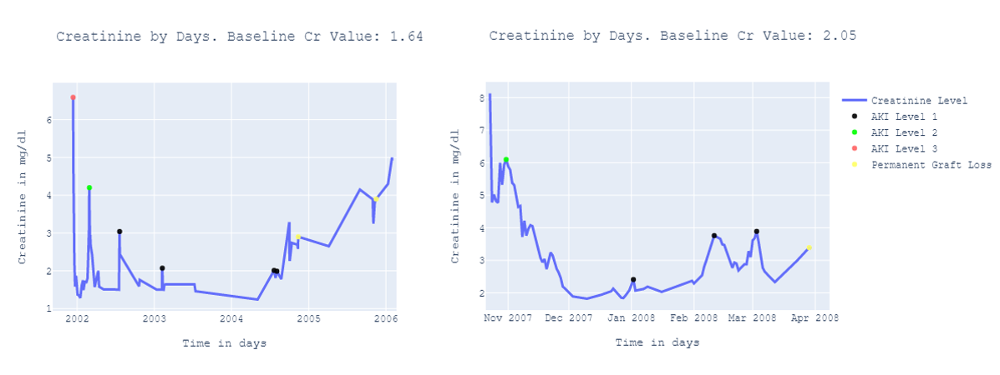

## Introduction

**This Repository is currenlty under development**

This project lets you detect Acute Kidney Injures (AKI's) from time series data. It does not use Machine- or Deep learning, however it implements rules defined by scientific papers to that define an AKI. The used papers can be found at the bottom of the read me. 

If you would like to see the state of the project check out the trello board. ->
[Trello Board](https://trello.com/b/JrzoR8ww)

## Getting started

Most of the definitions of AKI use a basline creatinine value. This value is individual for each patient and can depend on diffent factors. Using the **aki_baseline_calculation.py** you are able to calculate those values. Most of the definitions use age, gender and ethnicity of the patient.
Using the basline you are able to generate aki incidences for time series data. Import one of the __aki_detection.py__ scripts and pass the time series plus your creatinine baseline.

Your input table needs to be a pandas dataframe and might differ a little bit for the different definitions. However for the RIFLE definition it should look like this:

| PatientID        | Cr_Value           | Date  |
| ------------- |:-------------:| -----:|
| 1234      | 1.32 | 12.3.2020 |
| 1234      | 1.01      |   17.3.2020 |
| 1234 | 1.25      |    02.4.2020 |

You should receive a new dataframe with the AKI levels for every date. 

Example:


```python
from aki_baseline_calculation import get_MDRD_baseline_creatinine as MDRD_Cr_baseline
from aki_detection_rifle_score import detect_akis
from aki_visualization import visualize_aki_data

patientID = 1234
cr_time_series = pd.read_csv("example.csv")

cr_baseline = MDRD_Cr_baseline(age = 42, is_female = True, is_black = True)

cr_baseline_df = pd.DataFrame(data = [{"PatientID": patientID, "Create_Baseline": cr_baseline}])

aki_df = detect_akis(cr_time_series, cr_baseline_df)

visualize_aki_data(aki_df[aki_df["PatientID"] == patientID], cr_baseline)
```

Executing this code and naming everything right should give you these graphs.




# Further readings on AKI definitions

## The definition of acute kidney injury and its use in practice

- [ ] Read

Paper: [Mark E. Thomas 2017](https://www.sciencedirect.com/science/article/pii/S0085253815300351)


## RIFLE (Pediatric Risk, Injury, Failure, Loss, End Stage Renal Disease) score identifies Acute Kidney Injury and predicts mortality in critically ill children : a prospective study

- [ ] Read

Paper: [Yadira A.2013](https://www.ncbi.nlm.nih.gov/pmc/articles/PMC4238883/)

## The RIFLE and AKIN classifications for acute kidney injury: a critical and comprehensive review

- [ ] Read

Paper: [António2013](https://watermark.silverchair.com/sfs160.pdf?token=AQECAHi208BE49Ooan9kkhW_Ercy7Dm3ZL_9Cf3qfKAc485ysgAAApQwggKQBgkqhkiG9w0BBwagggKBMIICfQIBADCCAnYGCSqGSIb3DQEHATAeBglghkgBZQMEAS4wEQQMIBmHZvDoXeCgJbYNAgEQgIICRwyBQjoe9O_yLnwvWrjoNLfdCHGyx7bvtozO5FVmjqGh32SmQ4ABjJQoOA7SAeTwVzxAoW8btrP2Vx0qMC6VqkIQnNpBFecEN3ZgEfKC3KLR-p-xRqA9w11XrUsIchiEeVduJE5kRGgvXd_hoV_YTm3UM71CJqPMb_6TgC4_T2_ihLWsoSryjvUbkTLt49_Ggf0dEM7vm0A8sxJ7NepKfSDGdpfiwiHeGlzRuRLDOVTtWjq3c1LhQmDABrgBaCaA2sIghAvTAXqYdcuw2v4DBfAdkeVvK8fGHaruSNQawoe8shSmr50CJDrJ8GDzUq5BaepaS1z-L_NVO0er3lE_4ATLxftSRWXey44rMetsjCn_vDnk0sdWYyFIj7p2kCQbUI6HphGuI95g52IxClzrHLbs2hj9HNlsCEdR6aNNGnk3itRQCem8aR3gV9AloddP5LdUFYmWVS8i3n7vIbWvPJORgKTdnHPu4FhmB_CpHuKqcG9f_7w_xAx5GxvMKsPSE0f3W0UKaGfnfp85lwzu9zJpgWcDzqv8C8SqHZtwXeoFN3YP9fqunCfEn5WCCqKWG_zBVglGJA476snoFWSvFXbYvsia6S2RcvmqsbCAYW_0SxQvmfuQtJKt6ISw4PIbRrtph_tkzyQ0V6UZ3KxcUsfQUpgrCwDq_wk0zgB-TPa2sUtt8zdJPlkZ4EqBBgAGfHinVsUV4tmlOQQ2jSEOK2G-YkvOFRVtRSqC-Z42eEGJzDKWY_c0trVpVM152AI424BRcFig_4g)

# On Baseline Creatinine

## A comparison of three methods to estimate baseline creatinine for RIFLE classification

- [x] Read

Paper: [Jakub Závada2010](https://academic.oup.com/ndt/article/25/12/3911/1863037)


## Comparison of Three Methods Estimating Baseline Creatinine For Acute Kidney Injury in Hospitalized Patients: a Multicentre Survey in Third-Level Urban Hospitals of China

- [ ] Read

Paper: [Lang X2018](https://www.karger.com/Article/FullText/487366)

## The calculation of baseline serum creatinine overestimates the diagnosis of acute kidney injury in patients undergoing cardiac surgery

- [ ] Read

Paper: [Candela-Toha2012](https://academic.oup.com/ndt/article/25/12/3911/1863037)
